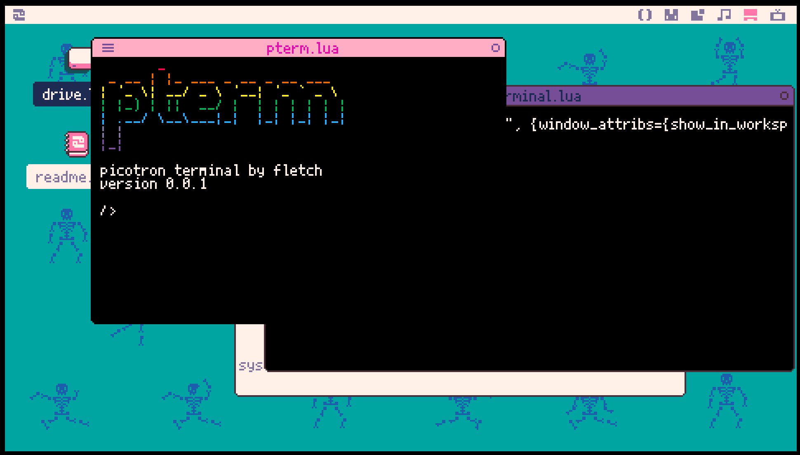

# picotron-pterm

A better, more colorful terminal to use in Picotron!

## Overview

**pterm** is intended to be a standalone terminal utility that builds on the experience Picotron's default **terminal.lua** provides. In addition to the CLI and utilities **terminal.lua** provides, **pterm** aims to provide:

- color printing
- extensibility
- requesting information from the user
- passing control back and forth between pterm.lua and the process(es) initiated by pterm.lua

## Intended Usage

- Use as a standalone terminal:

  - run `create_process()` to start a pterm
  - use [sedish](https://www.lexaloffle.com/bbs/?pid=143638) to edit system files to change the default terminal to pterm.lua

- Use as a CLI for your program:

  - Copy/paste pterm.lua and pterm_io.lua into your project files
  - `include "pterm_io.lua"` and use `create_pterm()` to launch a pterm process
  - use the pterm_io library to interact with and control the pterm window

## To Do

- get to release 1.0 by cleaning up existing TODO comments
- add support for easy terminal-menu creation (prompt user with multiple options, use arrow keys and enter to select)
- ...?

## Contributors

- [fletch](https://fletchmakesstuff.com)
